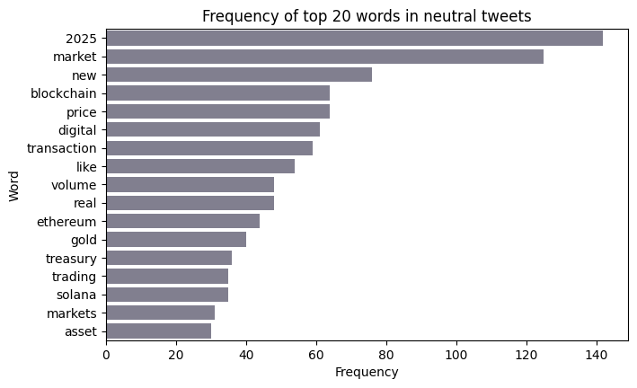
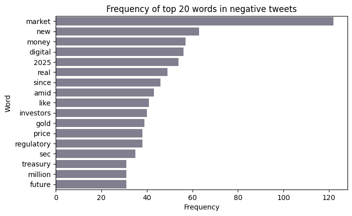
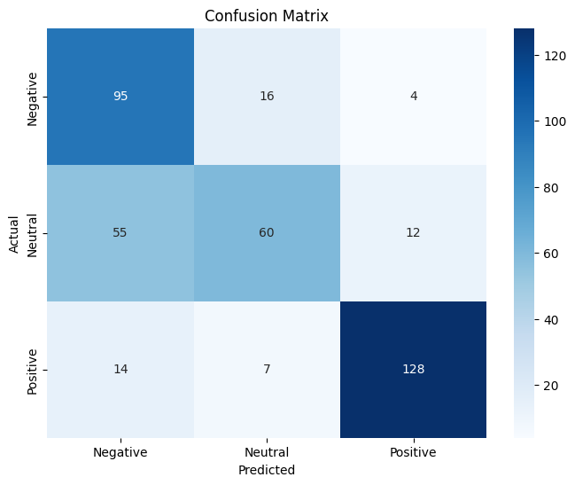

# Crypto Sentiment Analysis using Bidirectional LSTM

## Project Overview
This project builds a Deep Learning model to classify cryptocurrency-related tweets into three sentiments: **Positive, Neutral, and Negative**. 

Using a **Bidirectional LSTM (Long Short-Term Memory)** network, the model captures the sequential context of text, handling the unique vocabulary of the crypto market ("HODL", "Bearish", "DeFi").

## Key Features
- **Text Preprocessing:** Custom cleaning pipeline (removing hashtags, handles, stopword filtering).
- **Architecture:** Bidirectional LSTM with Dropout and L2 Regularization.
- **Hyperparameter Tuning:** Used `GridSearchCV` to optimize Learning Rate and Dropout.
- **Imbalance Handling:** Applied `class_weights` and `EarlyStopping` to prevent bias and overfitting.
## Dataset & Preprocessing

### Data Distribution
The dataset consists of **2,601 tweets** related to cryptocurrency. The class distribution shows a slight imbalance, which was handled using class weights during training.

| Sentiment | Count |
|-----------|-------|
| Positive  | 1,000 |
| Neutral   | 827   |
| Negative  | 774   |

### Data Splits
The data was split to ensure robust evaluation:
- **Training Set:** 1,820 samples
- **Validation Set:** 390 samples
- **Test Set:** 391 samples

### Data Insights
<!---->
*Positive tweets are dominated by terms like "growth", "value", and "trust".*
| Top 20 words for  Positive Tweets            | Top 20 words for Neutral Tweets                       | Top 20 words for Negative Tweets |               
| -------------------------------------------- | ----------------------------------------------------- | ------------------------------------------------------------- |
| |           |                  |

## Results
The model achieved an **F1-Score of 0.72** (up from a baseline of 0.58).

| Class | Precision | Recall | F1-Score |
|-------|-----------|--------|----------|
| Negative | 0.58 | 0.83 | 0.68 |
| Neutral | 0.72 | 0.47 | 0.57 |
| Positive | 0.89 | 0.86 | 0.87 |

## Performance Analysis:
As seen in the Confusion Matrix, the model excels at detecting Positive sentiment (F1: 0.87). However, there is some confusion between Negative and Neutral tweets. This is likely due to the overlap in vocabulary (e.g., words like "market" and "price" appear frequently in both).
<!-- <p align="right">
  
</p> -->


### Training Performance
| Training and Validation Loss | Training and Validation Accuracy |
| :---: | :---: |
|  |  |

<!--
-->
*The model shows healthy convergence with minimal overfitting due to regularization techniques.*


##  Data Engineering Pipeline: From Scraping to Synthetic Augmentation

Unlike standard projects that use pre-cleaned Kaggle datasets, I built this dataset from scratch to simulate a real-world data collection pipeline.

### 1. Data Collection & Scraping
- **Custom Scraper:** Implemented a custom scraping script to fetch raw crypto-related tweets.
- **Diversity Injection:** To ensure coverage of niche market events, I gathered additional headlines and context using **Perplexity AI** (Sonar model) prompting.

### 2. Synthetic Data Augmentation
To tackle the data scarcity problem (common in specific domain NLP), I developed a synthetic generation pipeline:
- **Prompt Engineering:** Designed prompts to generate **10 variations** for each original tweet, preserving the core sentiment but varying the vocabulary and sentence structure.
- **Impact:** Expanded the dataset size significantly while maintaining semantic consistency.

### 3. "Human-in-the-Loop" Annotation Strategy
Labeling thousands of tweets manually is inefficient. I used a semi-supervised approach:
1.  **Seed Set:** Manually annotated the first **150 tweets** to establish ground truth guidelines.
2.  **AI-Assisted Labeling:** Used Large Language Model (LLM) prompting to label the remaining dataset based on the patterns of the seed set.
3.  **Verification:** Randomly sampled the AI-labeled data to ensure quality control.

> **Result:** A robust, balanced dataset of more than 2k+ samples created from a small seed of raw observations.
### Text Processing Pipeline
1.  **Tokenization & Lemmatization:** Tweets were tokenized and lemmatized using a POS (Parts of Speech) tagger to ensure words are reduced to their root form correctly (e.g., "running" -> "run").
2.  **Target Encoding:** Sentiment labels were encoded using `LabelEncoder`.
3.  **Sequence Statistics:** 
    - Average tweet length: **28.4 words**
    - Maximum tweet length: **57 words**
4.  **Padding:** All sequences were padded to a fixed length of **80** to accommodate the longest tweets while allowing a safety buffer.

##  Model Architecture & Embeddings

- **Word Embeddings:** utilized pre-trained **GloVe embeddings (Global Vectors for Word Representation)**.
    - Version: 6 Billion tokens
    - Dimension: 200-dimensional vectors
    - *Note: Transfer learning via GloVe helps the model understand semantic relationships between words even with a small dataset.*
      
##  Technologies Used
- **Python**
- **TensorFlow / Keras** (Model building)
- **Scikit-Learn** (GridSearch, Metrics)
- **NLTK** (Tokenization, Stopwords)
- **Pandas/NumPy** (Data Manipulation)

## How to Run
1. Clone the repo:
   ```bash
   git clone https://github.com/d-payel/coinSentiment_lstm.git
