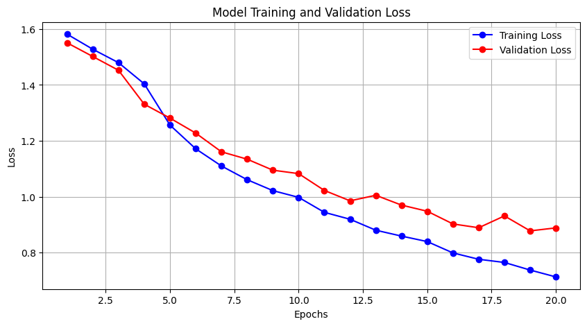
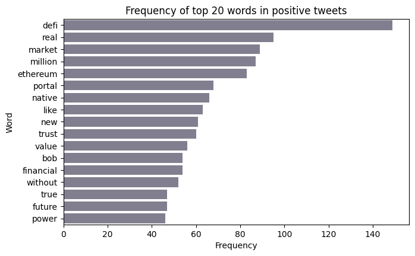

# 🪙 Crypto Sentiment Analysis using Bidirectional LSTM

## 📌 Project Overview
This project builds a Deep Learning model to classify cryptocurrency-related tweets into three sentiments: **Positive, Neutral, and Negative**. 

Using a **Bidirectional LSTM (Long Short-Term Memory)** network, the model captures the sequential context of text, handling the unique vocabulary of the crypto market ("HODL", "Bearish", "DeFi").

## 🚀 Key Features
- **Text Preprocessing:** Custom cleaning pipeline (removing hashtags, handles, stopword filtering).
- **Architecture:** Bidirectional LSTM with Dropout and L2 Regularization.
- **Hyperparameter Tuning:** Used `GridSearchCV` to optimize Learning Rate and Dropout.
- **Imbalance Handling:** Applied `class_weights` and `EarlyStopping` to prevent bias and overfitting.

## 📊 Results
The model achieved an **F1-Score of 0.72** (up from a baseline of 0.58).

| Class | Precision | Recall | F1-Score |
|-------|-----------|--------|----------|
| Negative | 0.58 | 0.83 | 0.68 |
| Neutral | 0.72 | 0.47 | 0.57 |
| Positive | 0.89 | 0.86 | 0.87 |

### Training Performance


*The model shows healthy convergence with minimal overfitting due to regularization techniques.*

### Data Insights

*Positive tweets are dominated by terms like "growth", "value", and "trust".*

## 🛠️ Technologies Used
- **Python**
- **TensorFlow / Keras** (Model building)
- **Scikit-Learn** (GridSearch, Metrics)
- **NLTK** (Tokenization, Stopwords)
- **Pandas/NumPy** (Data Manipulation)

## 📂 How to Run
1. Clone the repo:
   ```bash
   git clone https://github.com/d-payel/coinSentiment_lstm.git
